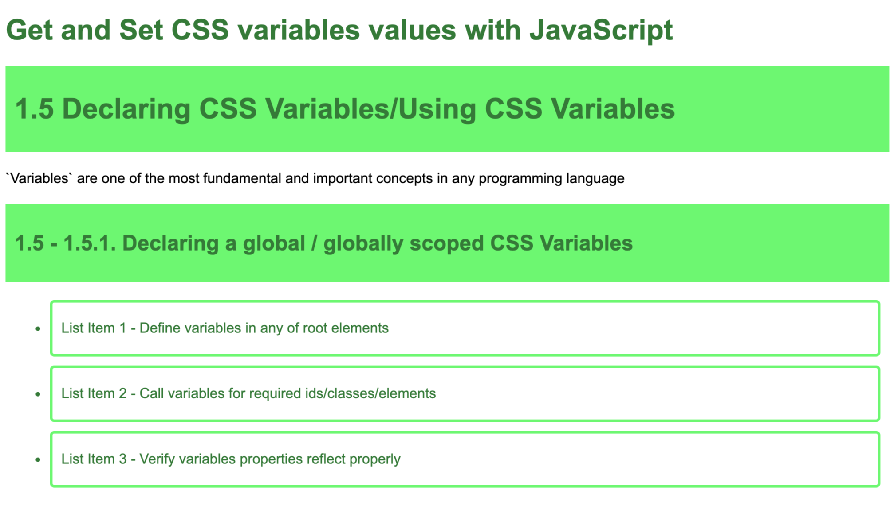
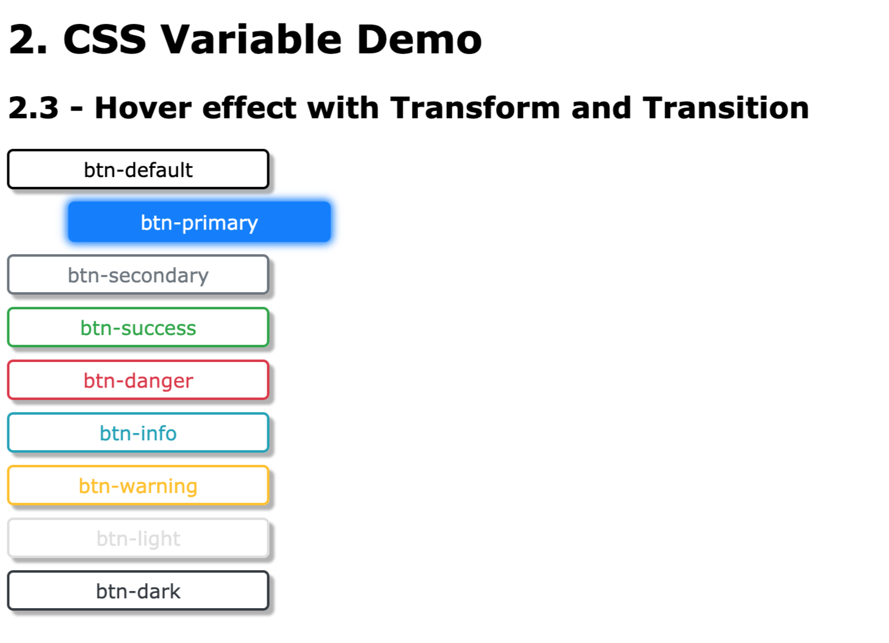
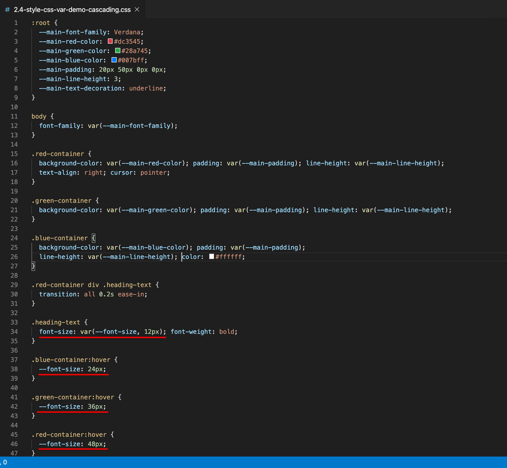

<p align="center">
 
</p>

CSS Variables = CSS custom properties
=====================

`Variables` are one of the most fundamental concepts in any programming language. A `variable is container/holder to store/hold the data/information` for future programming use or calculation purpose.

`Custom properties sometimes also referred to as CSS variables or Cascading variables` are nothing but entities that contain specific values to be reused/accessed throughout a document and saves lots of time while editing large/huge websites.

CSS variables set/defined/declared using custom property notation (e.g., `--base-color: black;`) and are accessed/called using the `var() function` (e.g., `background-color: var(--base-color);`).

Welcome
---------------------

Hi All, I'm **`Dinanath Jayaswal, Senior UI/Web Developer and Adobe Certified Expert Professional`**, I wanna welcome you to CSS Variables-CSS custom properties practical Guide/Tutorial for beginners. 

About the Course/Tutorial
---------------------

This is a comprehensive guide to use the CSS Variables-CSS custom properties. This complete guide explains everything you want to know/learn about the CSS Variables-CSS custom properties.

Who is this for? 
---------------------

This Course/Tutorial is ideal for:
- Any Web designer/developer interested in getting a deep understanding of CSS Advanced-latest features like CSS Variables-CSS custom properties
- CSS lovers want to acquire knowledge of next/latest CSS level (properties/features)
- Candidates desire to become CSS Expert and better Front End web Developer / Designer
- Web designers/developers who want to improve skills with new web standards
- Anyone who knows CSS and wants to dive deeper with upcoming features
- Anyone wants to sharpen their CSS skills

Course/Tutorial achievement
---------------------
Course/Tutorial Goal
---------------------

After completing/attending/finishing this Course/Tutorial, participants should be able to: 
- Create your style sheets those are less repetitive and easier to maintain
- Write CSS with less repetition, better readability, and more flexibility
- Use and follow the power of advanced CSS Variables features in huge websites/applications
- Declare and use the CSS variables in the Global and Local Scope
- Understand the difference between CSS variables and Preprocessors (like SASS, LESS) variables

Prerequisites for current course / What you need to know
---------------------

- Basic/Intermediate knowledge of HTML5 and CSS3
- Basics of JavaScript will be an added advantage

Topics included/covered
=====================

1. [Introduction to CSS Variables/Custom Properties](#1-introduction-to-css-variables-custom-properties)
    - 1.1. [What are Variables](#11-what-are-variables)
    - 1.2. [What are CSS Variables](#12-what-are-css-variables)
    - 1.3. [Why CSS Variables](#13-why-css-variables) | 
    [CSS Variable Benefits](#13-css-variable-benefits)
    - 1.4. [Browser support](#14-browser-support)
    - 1.5. [Declaring CSS Variables](#15-declaring-css-variables) | 
    [Using CSS Variables](#15-using-css-variables)
    - 1.6. [CSS Variables vs Preprocessor Variables](#16-css-variables-vs-preprocessor-variables) | [Difference Between CSS Variables and Preprocessor Variables](#16-difference-between-css-variables-and-preprocessor-variables)
    - 1.7. [CSS Variables with JavaScript](#17-css-variables-with-javascript)
    - 1.8. [CSS Variables var() function](#18-css-variables-var-function)
    
2. [CSS Variables Practical Demo Examples](#2-css-variables-practical-demo-examples)
    - 2.1. [Managing Colors-Theme](#21-managing-colors-theme) 
    - 2.2. [Hover with Fallback support](#22-hover-with-fallback-support) 
    - 2.3. [Hover with Transform Transition Amimation](#23-hover-with-Transform-transition-amimation) 
    - 2.4. [CSS variables Cascading](#24-css-variables-cascading) 
    - 2.5. [JavaScript Theme Switcher](#25-javascript-theme-switcher) | [JavaScript Theme Color Swatch Switcher](#25-javascript-theme-color-swatch-switcher) 
    - 2.6. [Media Query Responsive Layout](#26-media-query-responsive-layout)
    - 2.7. [CSS Variables Gradients](#27-css-variables-gradients)

3. [CSS Variables Resources](#3-css-variables-resources)

1 Introduction to CSS Variables Custom Properties
=====================

- CSS is static stylesheet language/mostly a declarative language, lacking in dynamic capabilities/Programming features-terminologies like variables, mixin, function, re-usable classes, etc.
- To overcome all CSS disadvantages and add advanced programming features-terminologies, earlier/in past we have used CSS pre-processors like `SASS` or `LESS`, but now a days it's possible to use those features in pure/native CSS with CSS3 advanced features i.e. Custom Properties

1.1. What are Variables
---------------------

- `Variables` are one of the most fundamental and important concepts in any programming language
- A variable is `container/holder to store/hold the data/information`
- A variable is a kind of data holder where we can store some value for future further programming use or calculation purpose
- A JavaScript variable is simply a `name of the storage location (named containers/named storage)` for data
- Variables are `symbolic names for values` 
- Variables are used to store data of different types like a `string` of text, `numbers`, `boolean` values like true/false, an `array` or `object` of data, etc. 
- The data or value stored in the variables can be `set`, `updated`, and `retrieved` whenever needed
- Variables let you store and update different values your program needs in order to perform some work
- Variables are declared using the keyword `var` keyword
- The `assignment operator (=)` is used to assign value to a variable, like this: `var varName = value;` or `var firstName = 'JavaScript';`
- **Example**: Variables are like `box or an envelope` which we use to `organize various kinds of stuff` and put a `label` on each box or an envelope
- **Example**: Variable declaration and assignment is just `like Maths & Algebra`: `x = 10`; and in JavaScript we write `var x = 10;`
> **Note**: Depending on programming language, the different assignment operator like `equal to =` or `colon :` is used to assign value to a variable

- For learning/understanding purpose/instance, lets consider the following JavaScript snippet:
```js
// javascript variables - variables defined to hold different types of data
var techName = 'JavaScript'; // String literal 
var version = 6; // Number literal
var isDone = true; // Boolean literal

console.log('Learning '+techName+version);

var firstName = 'Dinanath ';
let lastName = 'Jayaswal'
const fullName = firstName + lastName
```

> **Syntax & Example**: `1.1-javascript-variable.html`

```html
<!DOCTYPE html>
<html lang="en">

  <head>

    <meta charset="UTF-8">
    <meta name="viewport" content="width=device-width, initial-scale=1.0">
    <meta http-equiv="X-UA-Compatible" content="ie=edge">
    <title>1.1-javascript-variable.html</title>

    <!-- internal style -->
    <style>
      /* css selector: { property:value; } */
      body {
        font-family: arial;
      }
    </style>

  </head>

  <body>
    
    <!-- include external JavaScript - body section -->
    <script src="./1.1-script.js"></script>
    
  </body>

</html>
```

> **Syntax & Example**: `1.1-script.js`

```js
// external js file
// Write all JavaScript code here

// variables defined to hold different types of data
var techName = 'JavaScript'; // String literal 
var version = 6; // Number literal
var isDone = true; // Boolean literal

console.log('Learning '+techName+version);

// ------------------------------

// Declaring Variable
var userName;

// Assigning value
userName = 'Dinanath';

console.log('Welcome '+userName);

// ------------------------------

// Declaring multiple variables
var firstName = 'Dinanath', lastName = 'Jayaswal', age = 35, isMarried = 'true';

// Declaring multiple variables in multiple lines for readability
/* var firstName = 'Dinanath', 
lastName = 'Jayaswal', 
age = 35, 
isMarried = 'true'; */

console.log('I am ' + firstName + ' ' + lastName);
```

<p>
  <figure>
    &nbsp;&nbsp;&nbsp; 
    <figcaption>&nbsp;&nbsp;&nbsp; Image 1.1 - JavaScript variables declaration and use </figcaption>
  </figure>
</p>

1.2. What are CSS Variables
---------------------

- CSS Variables look like a simple regular CSS properties with an extra `dashes --` before them: `--variable-name: value;` e.g., `--base-font: Arial;`
- CSS variables set/defined/declared using custom property notation (e.g., `--base-color: black;`) and are accessed/called using the `var() function` (e.g., `background-color: var(--base-color);`).
- CSS Variables are also known as "Custom Properties", simply we can say `CSS Variables == Custom Properties`
- `Custom properties sometimes also referred to as CSS variables or Cascading variables` are nothing but entities that contain specific values to be reused/accessed throughout a document and saves lots of time while editing CSS properties and values in large/huge websites
- `CSS variables` are very handy and useful when we are working with huge/large websites with repetitive properties and styles (many properties like color,font-size, margins, etc)
- By using `CSS variables` In case of any `global change needed` through-out the application, instead of changing every occurrence/instance its advisable to change the `single variable` so it will reflect globally
- Custom properties do follow CSS mechanisms/principles and so they cascade, inherit their value from their parent. 
- CSS variables can be defined with or as Global or Local scope

> **Syntax & Example**: `1.2.1-old-css-way-repetition.html`

```html
<!DOCTYPE html>
<html lang="en">

  <head>

    <meta charset="UTF-8">
    <meta name="viewport" content="width=device-width, initial-scale=1.0">
    <meta http-equiv="X-UA-Compatible" content="ie=edge">
    <title>1.2.1-old-css-way-repetition.html</title>

    <link rel="stylesheet" href="./1.2.1-style-old-way-repetition.css">
  
  </head>

  <body>
    
    <div class="container">

      <div class="sub-container">

        <h1 class="heading-text" id="mainHeadingText">1.2 What are CSS Variables</h1>

        <p class="para-text" id="mainParaText">`Variables` are one of the most fundamental and important concepts in any programming language</p>

        <h2 class="subheading-text" id="subHeadingText">1.2 - 1.2.1 old css way repetition</h2>

      </div>

    </div>
  
  </body>

</html>
```

> **Syntax & Example**: `1.2.1-style-old-way-repetition.css`

```css
body {
  font-family: arial;
}

.heading-text {
  background-color: #f66969;
  color: #ffffff
  padding: 10px;
}

/* same property used above with .heading-text are repeated */
.subheading-text {
  background-color: #f66969;
  color: #ffffff
  padding: 10px;
}
```

<p>
  <figure>
    &nbsp;&nbsp;&nbsp; 
    <figcaption>&nbsp;&nbsp;&nbsp; Image 1.2.1 - The old CSS way of repeating value </figcaption>
  </figure>
</p>

<p>
  <figure>
    &nbsp;&nbsp;&nbsp; 
    <figcaption>&nbsp;&nbsp;&nbsp; Image 1.2.1.1 - The old CSS way of repeating value </figcaption>
  </figure>
</p>

<hr/>

> **Syntax & Example**: `1.2.2-new-css-way-variables.html`

```html
<!DOCTYPE html>
<html lang="en">

  <head>

    <meta charset="UTF-8">
    <meta name="viewport" content="width=device-width, initial-scale=1.0">
    <meta http-equiv="X-UA-Compatible" content="ie=edge">
    <title>1.2.2-new-css-way-variables.html</title>

    <link rel="stylesheet" href="./1.2.2-style-new-css-way-variables.css">
  
  </head>

  <body>
    
    <div class="container">

      <div class="sub-container">

        <h1 class="heading-text" id="mainHeadingText">1.2 What are CSS Variables</h1>

        <p class="para-text" id="mainParaText">`Variables` are one of the most fundamental and important concepts in any programming language</p>

        <h2 class="subheading-text" id="subHeadingText">1.2 - 1.2.2 new css way variables</h2>

      </div>

    </div>
  
  </body>

</html>
```

> **Syntax & Example**: `1.2.2-style-new-css-way-variables.css`

```css
/* CSS selectors must set/defined/declared inside any root selector like `:root` or `body`, so that these variables exists globally/entire document to use */
:root {
  --font-face: Arial;
  --base-bg-color: #f66969;
  --base-text-color: #ffffff;
  --base-padding: 10px;
}

body {
  font-family: var( --font-face);
}

.heading-text {
  /* background-color: #f66969;
  color: #ffffff;
  padding: 10px; */

  /* access/call/use variables with var() function*/
  background-color: var(--base-bg-color);
  color: var(--base-text-color);
  padding: var(--base-padding);
}

.subheading-text {
  /* background-color: #f66969;
  color: #ffffff;
  padding: 10px; */

  background-color: var(--base-bg-color);
  color: var(--base-text-color);
  padding: var(--base-padding);
}
```

<p>
  <figure>
    &nbsp;&nbsp;&nbsp; 
    <figcaption>&nbsp;&nbsp;&nbsp; Image 1.2.2 - The new CSS way of using variables - DRY - Do Not Repeat Yourself principle </figcaption>
  </figure>
</p>

<p>
  <figure>
    &nbsp;&nbsp;&nbsp; 
    <figcaption>&nbsp;&nbsp;&nbsp; Image 1.2.2 - The new CSS way of using variables - DRY - Do Not Repeat Yourself principle </figcaption>
  </figure>
</p>

1.3. Why CSS Variables
---------------------
1.3. CSS Variable Benefits
---------------------

- The benefits of using variables in CSS are not that much different than from those of using variables in any other programming languages (define/initiate once and use when required)
- The beauty of variables is that they let you store your valuables/properties in one place and update it on the fly for several various purposes
- As your web apps grow bigger, the CSS becomes big, redundant and many times messy. Used within a good context, the CSS variables, give you the mechanism to reuse and easily change repeatedly occurring CSS properties
- Its helpful in following `DRY - Do Not Repeat Yourself` principle, One of the most compelling thing is that it reduces repetition in your stylesheet
- Create your style sheets those are less repetitive and easier to maintain
better readability, and more flexibility
- One can easily access and overwrite CSS variables inside Media Query
- Anytime we can create and use scoped variables used only for a particular element like the following variable is used only for a top navigation bar: `.nav-top { --base-link-color: #ed143d; }`

1.4. Browser support
---------------------

The CSS Variable - custom properties are supported well in all modern browsers, except Internet Explorer

<p>
  <figure>
    &nbsp;&nbsp;&nbsp; 
    <figcaption>&nbsp;&nbsp;&nbsp; Image 1.4 - CSS Variables browser support </figcaption>
  </figure>
</p>

1.5. Declaring CSS Variables
---------------------
1.5. Using CSS Variables
---------------------

- CSS Variables look like a simple regular CSS properties with an extra `dashes --` before them: `--variable-name: value;` ie. `--base-font: Arial;`
- CSS variables set/defined/declared using custom property notation (e.g., `--base-color: black;`) and are accessed/called using the `var() function` (e.g., `background-color: var(--base-color);`).
> **Note**: CSS selectors must set/defined/declared inside any root selector like `:root` or `body`, so that these variables exists globally/entire document to use

> **Syntax**: `Define and use css variables`
```css
/* define variables */
:root {
  --base-theme-color: #4caf50; /* green shade */
  --base-link-color: #cddc39; /* yellow lemon shade */
}

/* call/use variables */
body {
  background-color: var(--base-theme-color);
}

a:link {
  color: var(--base-link-color);
}
```

1.5.1.1. Declaring a global / globally scoped CSS Variables - Create a Green Theme
---------------------

> **Syntax & Example**: `1.5.1.1-define-variables-global-green-theme.html`

```html
<!DOCTYPE html>
<html lang="en">

  <head>

    <meta charset="UTF-8">
    <meta name="viewport" content="width=device-width, initial-scale=1.0">
    <meta http-equiv="X-UA-Compatible" content="ie=edge">
    <title>1.5.1.1-define-variables-global-green-theme.html</title>

    <link rel="stylesheet" href="1.5.1.1-style-define-variables-global-green-theme.css">
  
  </head>

  <body>
    
    <div class="container">

      <div class="sub-container">

        <h1 class="top-heading-text" id="topHeadingText">Create a Green Theme with CSS variables</h1>

        <h1 class="heading-text" id="mainHeadingText">1.5 Declaring CSS Variables/Using CSS Variables</h1>

        <p class="para-text" id="mainParaText">`Variables` are one of the most fundamental and important concepts in any programming language</p>

        <h2 class="subheading-text" id="subHeadingText">1.5 - 1.5.1. Declaring a global / globally scoped CSS Variables</h2>

        <ul>
          <li>List Item 1 - Define variables in any of root elements </li>
          <li>List Item 2 - Call variables for required ids/classes/elements</li>
          <li>List Item 3 - Verify variables properties reflect properly</li>
        </ul>
      
      </div>

    </div>
  
  </body>

</html>
```

> **Syntax & Example**: `1.5.1.1-style-define-variables-global-green-theme.css`

```css
/* CSS selectors must set/defined/declared inside any root selector like `:root` or `body`, so that these variables exists globally/entire document to use */
:root {
  /* global scoped variables */
  --font-face: Arial;
  --base-bg-color: #66f969;
  --base-text-color: #327b34;
  --base-padding: 30px 10px;

  /* list item related variables */
  --list-item-margin: 10px;
  --list-item-padding: 20px 10px;
  --list-item-corner-radius: 5px;
}

body {
  font-family: var(--font-face);
}

.top-heading-text {
  color: var(--base-text-color);
}

.heading-text {
  /* access/call/use/apply/refer variables with var() function*/
  background-color: var(--base-bg-color);
  color: var(--base-text-color);
  padding: var(--base-padding);
}

.subheading-text {
  background-color: var(--base-bg-color);
  color: var(--base-text-color);
  padding: var(--base-padding);
}

ul > li {
  color: var(--base-text-color);
  padding: var(--list-item-padding);
  border: 3px solid var(--base-bg-color);
  border-radius: var(--list-item-corner-radius);
  margin: var(--list-item-margin);
}
```

<p>
  <figure>
    &nbsp;&nbsp;&nbsp; 
    <figcaption>&nbsp;&nbsp;&nbsp; Image 1.5.1.1 - Declaring & Using CSS Variables - Create a Green Theme </figcaption>
  </figure>
</p>

<hr/>

<p>
  <figure>
    &nbsp;&nbsp;&nbsp; 
    <figcaption>&nbsp;&nbsp;&nbsp; Image 1.5.1.1 - Declaring & Using CSS Variables - Styles Create a Green Theme </figcaption>
  </figure>
</p>

1.5.1.2. Declaring a global / globally scoped CSS Variables - Convert above Green Theme to Blue Theme
---------------------

It is pretty easy to change the variable values once at a central place and it simply modifies the themes or base properties look/feel/appearance

- To convert above metioned Green Theme into Blue Theme, just change: `--base-bg-color: #6696f9; --base-text-color: #37327b` and you are done.

> **Syntax & Example**: `1.5.1.2-define-convert-variables-global-blue-theme.html`

```html
<!DOCTYPE html>
<html lang="en">

  <head>

    <meta charset="UTF-8">
    <meta name="viewport" content="width=device-width, initial-scale=1.0">
    <meta http-equiv="X-UA-Compatible" content="ie=edge">
    <title>1.5.1.2-define-convert-variables-global-blue-theme.html</title>

    <link rel="stylesheet" href="./1.5.1.2-style-define-convert-variables-global-blue-theme.css">
  
  </head>

  <body>
    
    <div class="container">

      <div class="sub-container">

        <h1 class="top-heading-text" id="topHeadingText">Create a Green Theme with CSS variables</h1>

        <h1 class="heading-text" id="mainHeadingText">1.5 Declaring CSS Variables/Using CSS Variables</h1>

        <p class="para-text" id="mainParaText">`Variables` are one of the most fundamental and important concepts in any programming language</p>

        <h2 class="subheading-text" id="subHeadingText">1.5 - 1.5.1. Declaring a global / globally scoped CSS Variables</h2>

        <ul>
          <li>List Item 1 - Define variables in any of root elements </li>
          <li>List Item 2 - Call variables for required ids/classes/elements</li>
          <li>List Item 3 - Verify variables properties reflect properly</li>
        </ul>
      
      </div>

    </div>
  
  </body>

</html>
```

> **Syntax & Example**: `1.5.1.2-style-define-convert-variables-global-blue-theme.css`

```css
/* CSS selectors must set/defined/declared inside any root selector like `:root` or `body`, so that these variables exists globally/entire document to use */
:root {
  /* global scoped variables */
  --font-face: Arial;
  --base-bg-color: #6696f9;
  --base-text-color: #37327b;
  --base-padding: 30px 10px;

  /* list item related variables */
  --list-item-margin: 10px;
  --list-item-padding: 20px 10px;
  --list-item-corner-radius: 5px;
}

body {
  font-family: var(--font-face);
}

.top-heading-text {
  color: var(--base-text-color);
}

.heading-text {
  /* access/call/use/apply/refer variables with var() function*/
  background-color: var(--base-bg-color);
  color: var(--base-text-color);
  padding: var(--base-padding);
}

.subheading-text {
  background-color: var(--base-bg-color);
  color: var(--base-text-color);
  padding: var(--base-padding);
}

ul > li {
  color: var(--base-text-color);
  padding: var(--list-item-padding);
  border: 3px solid var(--base-bg-color);
  border-radius: var(--list-item-corner-radius);
  margin: var(--list-item-margin);
}
```

<p>
  <figure>
    &nbsp;&nbsp;&nbsp; 
    <figcaption>&nbsp;&nbsp;&nbsp; Image 1.5.1.2 - Declaring & Using CSS Variables - Convert to Blue Theme </figcaption>
  </figure>
</p>

<hr/>

<p>
  <figure>
    &nbsp;&nbsp;&nbsp; 
    <figcaption>&nbsp;&nbsp;&nbsp; Image 1.5.1.2 - Declaring & Using CSS Variables - Styles Convert to Blue Theme </figcaption>
  </figure>
</p>

1.5.2. Declaring a local / locally scoped CSS Variables
---------------------

- We can also declare/create local variables, which are `accessible only to the declared element and it’s children`
- Local scoped CSS Variables are useful and make sense when we want to apply some properties and values only to a specific part(s) of app

> **Syntax & Example**: `1.5.2.1-define-variables-local.html`

```html
<!DOCTYPE html>
<html lang="en">

  <head>

    <meta charset="UTF-8">
    <meta name="viewport" content="width=device-width, initial-scale=1.0">
    <meta http-equiv="X-UA-Compatible" content="ie=edge">
    <title>1.5.2.1-define-variables-local.html</title>

    <link rel="stylesheet" href="1.5.2.1-style-define-variables-local.css">
  
  </head>

  <body>
    
    <div class="container">

      <div class="sub-container">

        <h1 class="heading-text" id="mainHeadingText">1.5 Declaring CSS Variables/Using CSS Variables</h1>

        <p class="para-text" id="mainParaText">`Variables` are one of the most fundamental and important concepts in any programming language</p>

        <h2 class="subheading-text" id="subHeadingText">1.5 - 1.5.1. Declaring a global / globally scoped CSS Variables</h2>

        <ul>
          <li>List Item 1 - Define variables in any of root elements </li>
          <li>List Item 2 - Call variables for required ids/classes/elements</li>
          <li>List Item 3 - Verify variables properties reflect properly</li>
        </ul>
      
      </div>

    </div>
  
  </body>

</html>
```

> **Syntax & Example**: `1.5.2.1-style-define-variables-local.css`

```css
:root {
  /* global scoped variables */
  --font-face: Arial;
  --base-bg-color: #f66969;
  --base-text-color: #ffffff;
  --base-padding: 30px 10px;

  --list-item-margin: 10px;
  --list-item-padding: 20px 10px;
  --list-item-corner-radius: 5px;
}

body {
  font-family: var(--font-face);
}

.heading-text {
  background-color: var(--base-bg-color);
  color: var(--base-text-color);
  padding: var(--base-padding);
}

.subheading-text {
  /* local scoped variables */
  --base-bg-color: #66f969;
  --base-text-color: #327b34;

  background-color: var(--base-bg-color);
  color: var(--base-text-color);
  padding: var(--base-padding);
}

ul > li {
  /* local scoped variables */
  --base-bg-color: #6696f9;
  --base-text-color: #37327b;

  background-color: var(--base-bg-color);
  color: var(--base-text-color);
  padding: var(--list-item-padding);

  border: 3px solid var(--base-bg-color);
  border-radius: var(--list-item-corner-radius);
  margin: var(--list-item-margin);
}
```

<p>
  <figure>
    &nbsp;&nbsp;&nbsp; 
    <figcaption>&nbsp;&nbsp;&nbsp; Image 1.5.2.1 - Declaring & Using CSS Variables - Create local scoped variables </figcaption>
  </figure>
</p>

<hr/>

<p>
  <figure>
    &nbsp;&nbsp;&nbsp; 
    <figcaption>&nbsp;&nbsp;&nbsp; Image 1.5.2.1 - Declaring & Using CSS Variables - Styles Create local scoped variables </figcaption>
  </figure>
</p>

1.6. CSS Variables vs Preprocessor Variables
---------------------
1.6. Difference Between CSS Variables and Preprocessor Variables
---------------------

Variables are one of the major reasons why CSS preprocessors like `SASS` or `LESS` introduced and exist at all in the web world. There are many differences between CSS Variables and Preprocessor Variables, some important differences are mentioned below:

| CSS Variables | Preprocessor Variables |
| --------------------------------------------------| --------------------------------------------------|
| Browser understand CSS, so no need for compilation as we are working with pure/native CSS | We need to convert/compile .SASS, .SCSS and .LESS source files into .CSS every time, so that the browser can understand compiled .CSS code|
| More recently, native CSS has started supporting CSS variables, or "CSS Custom Properties". It allows you to work with variables directly in CSS. There are no compiling | Preprocessors introduced to use programming features like Variable, Functions, Loops into CSS styling, so Preprocessors source files must compile into .CSS | 
| CSS variables are actually a part of the DOM | The variable was part of the preprocessor language (.SASS, .SCSS and .LESS files), not CSS itself. Once the code compiles, the variables are gone |
| CSS variables are always available and accessible while debugging with Inspect Element and one can easily change it from `Inspect -> Element -> Source` | The preprocessor code/variables would do nothing in a browser, The browser wouldn't understand the declarations and toss them out (.SASS, .SCSS and .LESS variables are not available in browser) |
| We can access and manipulate native CSS variables with JavaScript | As preprocessor uses (.SASS, .SCSS and .LESS) a separate file it is not accessible with JavaScript |
| One can easily access and overwrite CSS variables inside Media Query (as and when media or resolution changes the browser recheck/reassign/repaints the variable if needed | Sometimes it is not possible with preprocessor variables |

> **Note**: As Browser understands only CSS styling, the preprocessor code/variables would do nothing in a browser, The browser wouldn't understand the declarations and toss them out, that's the reason why Preprocessors files need to compile/converted into native CSS before sending/viewing into the browser

1.7. CSS Variables with JavaScript
---------------------

- One more super cool thing you can do is access CSS variables directly from your JavaScript code
- One of the important benefits of CSS Variables is that it can interact via the power of JavaScript
- While dealing with CSS Variables JavaScript widely uses `getComputedStyle()` `getProperty()` and `style.setProperty()` methods

> **Syntax & Example**: `1.7.1-css-variables-javascript-interaction.html`

```html
 <!DOCTYPE html>
<html lang="en">

  <head>

    <meta charset="UTF-8">
    <meta name="viewport" content="width=device-width, initial-scale=1.0">
    <meta http-equiv="X-UA-Compatible" content="ie=edge">
    <title>1.7.1-css-variables-javascript-interaction.html</title>

    <link rel="stylesheet" href="1.7.1-style-variables-javascript-interaction.css">
  
  </head>

  <body>
    
    <div class="container">

      <div class="sub-container">

        <h1 class="top-heading-text" id="topHeadingText">Get and Set CSS variables values with JavaScript</h1>

        <h1 class="heading-text" id="mainHeadingText">1.5 Declaring CSS Variables/Using CSS Variables</h1>

        <p class="para-text" id="mainParaText">`Variables` are one of the most fundamental and important concepts in any programming language</p>

        <h2 class="subheading-text" id="subHeadingText">1.5 - 1.5.1. Declaring a global / globally scoped CSS Variables</h2>

        <ul>
          <li>List Item 1 - Define variables in any of root elements </li>
          <li>List Item 2 - Call variables for required ids/classes/elements</li>
          <li>List Item 3 - Verify variables properties reflect properly</li>
        </ul>
      
      </div>

    </div>
    
    <script src="./1.7.1-script-variables-javascript-interaction.js"></script>
  
  </body>

</html>
```

> **Syntax & Example**: `1.7.1-style-variables-javascript-interaction.css`

```css
 :root {
  --font-face: Arial;
  --base-bg-color: #66f969;
  --base-text-color: #327b34;
  --base-padding: 30px 10px;

  --list-item-margin: 10px;
  --list-item-padding: 20px 10px;
  --list-item-corner-radius: 5px;
}

body {
  font-family: var(--font-face);
}

.top-heading-text {
  color: var(--base-text-color);
}

.heading-text {
  background-color: var(--base-bg-color);
  color: var(--base-text-color);
  padding: var(--base-padding);
}

.subheading-text {
  background-color: var(--base-bg-color);
  color: var(--base-text-color);
  padding: var(--base-padding);
}

ul > li {
  color: var(--base-text-color);
  padding: var(--list-item-padding);
  border: 3px solid var(--base-bg-color);
  border-radius: var(--list-item-corner-radius);
  margin: var(--list-item-margin);
}
```

> **Syntax & Example**: `1.7.1-script-variables-javascript-interaction.js`

```js
 console.log('in 1.7.1-script-variables-javascript-interaction.js');

// get the root element
var root = document.querySelector(':root');
//console.log('root', root);

// get all the styles/CSSStyleDeclaration for root
var rootStyles = getComputedStyle(root);
console.log('rootStyles', rootStyles);

// get --base-bg-color variable value available inside root styles
// var baseBgColor = rootStyles.getPropertyValue('--base-bg-color');
// console.log('baseBgColor', baseBgColor);

root.style.setProperty('--base-bg-color', '#f66969') // red- #f66969; green - #66f969; blue- #6696f9;
```

<p>
  <figure>
    &nbsp;&nbsp;&nbsp; 
    <figcaption>&nbsp;&nbsp;&nbsp; Image 1.7.1.1 - CSS variable interaction with JavaScript Original Green output </figcaption>
  </figure>
</p>

<hr/>

<p>
  <figure>
    &nbsp;&nbsp;&nbsp; 
    <figcaption>&nbsp;&nbsp;&nbsp; Image 1.7.1.2 - CSS variable interaction with JavaScript updated Red output </figcaption>
  </figure>
</p>

1.8. CSS Variables var() function
---------------------
 
- Any CSS variables defined in the stylesheet can be `accessed` by using `var()` function
- The CSS `var()` function can be used to insert the value of a custom property or a CSS variable
- The var() function cannot be used in any property names, selectors or anything else besides property values setting or providing fallback value support

> **Syntax**: ``` var(<custom-name>, <value>) ``` <br/>
> **Syntax**: ``` var( <custom-property-name> , <declaration-value>? ) ```

- ```var(--main-color, #ff7f50) ```
  - **`<custom-name>`**: **Required** Parameter. It's the custom property's name (must start with two dashes)
  - **`<value>`**: **Optional**. The fallback value. Used only if the custom property is invalid or not defined or not found in stylesheet context (fallback support)

2 CSS Variables Practical Demo Examples
=====================  

2.1. Managing Colors-Theme
---------------------

> **Syntax & Example**: `2.1-css-var-demo-managing-colors-themes.html`

```html
<!DOCTYPE html>
<html lang="en">

  <head>

    <meta charset="UTF-8">
    <meta name="viewport" content="width=device-width, initial-scale=1.0">
    <meta http-equiv="X-UA-Compatible" content="ie=edge">
    <title>2.1-css-var-demo-managing-colors-themes.html</title>

    <link rel="stylesheet" href="2.1-style-css-var-demo-managing-colors-themes.css">
  
  </head>

  <body>
    
    <div class="container">

      <h1 class="top-heading-text" id="topHeadingText">2. CSS Variable Demo</h1>
      
      <h2 class="subheading-text" id="subHeadingText">2.1 - Managing Colors Themes</h2>

      <article class="info-text">
        The benefits of using variables in CSS are not that much different than from those of using variables in any other programming languages (define/initiate once and use when required). <br/> <br/>
        The beauty of variables is that they let you store your valuables/properties in one place and update it on the fly for several various purposes. <br/>
      </article>

      <footer class="footer-text">This is footer Text</footer>

    </div>
  
  </body>

</html>
```

> **Syntax & Example**: `2.1-style-css-var-demo-managing-colors-themes.css`

```css
:root {
  /* define/set variables */
  --main-font-family: Verdana;
  --main-theme-color: #ff7f50;
  --main-line-height: 2;
}

body {
  font-family: var(--main-font-family);
  text-align: center;
}

.top-heading-text {
  /* refer/call variables */
  background-color: var(--main-theme-color);
  line-height: var(--main-line-height);
}

.subheading-text {
  color: var(--main-theme-color);
}

.info-text {
  color: var(--main-theme-color);
  margin: 0 auto;
  max-width: 70%;
  margin-bottom: 2em;
}

.footer-text {
  background-color: var(--main-theme-color);
  line-height: var(--main-line-height);
  font-size: 0.75em;
}
```

<p>
  <figure>
    &nbsp;&nbsp;&nbsp; 
    <figcaption>&nbsp;&nbsp;&nbsp; Image 2.1.1 - CSS Variables Demo - Managing Colors Themes </figcaption>
  </figure>
</p>

<p>
  <figure>
    &nbsp;&nbsp;&nbsp; 
    <figcaption>&nbsp;&nbsp;&nbsp; Image 2.1.2 - CSS Variables Demo - Style Managing Colors Themes </figcaption>
  </figure>
</p>

2.2. Hover with Fallback support
---------------------

> **Syntax & Example**: `2.2-css-var-demo-hover-fallback-support.html`

```html
<!DOCTYPE html>
<html lang="en">

  <head>

    <meta charset="UTF-8">
    <meta name="viewport" content="width=device-width, initial-scale=1.0">
    <meta http-equiv="X-UA-Compatible" content="ie=edge">
    <title>2.2-css-var-demo-hover-fallback-support.html</title>

    <link rel="stylesheet" href="2.2-style-css-var-demo-hover-fallback-support.css">
  
  </head>

  <body>
    
    <div class="container">

      <h1 class="top-heading-text" id="topHeadingText">2. CSS Variable Demo</h1>
      
      <h2 class="subheading-text" id="subHeadingText">2.2 - Hover effect with Fallback support</h2>

      <article class="info-text">
        - Any CSS variables defined in the stylesheet can be `accessed` by using `var()` function <br/>
        - The CSS `var()` function can be used to insert the value of a custom property or a CSS variable <br/>
        - The var() function cannot be used in any property names, selectors or anything else besides property values setting or providing fallback value support<br/> <br/>
      </article>

      <nav class="button-container">
        <div class="button btn-default">btn-default </div>
        <div class="button btn-primary">btn-primary </div>
        <div class="button btn-secondary">btn-secondary </div>
        <div class="button btn-success">btn-success </div>
        <div class="button btn-danger">btn-danger </div>
        <div class="button btn-info">btn-info </div>
        <div class="button btn-warning">btn-warning </div>
        <div class="button btn-light">btn-light </div>
        <div class="button btn-dark">btn-dark </div>
      </nav>

    </div>
  
  </body>

</html>
```

> **Syntax & Example**: `2.2-style-css-var-demo-hover-fallback-support.css`

```css
:root {
  /* define/set variables */
  --main-font-family: Verdana; --main-line-height: 2;
}

body {
  font-family: var(--main-font-family);
}

.top-heading-text {
  line-height: var(--main-line-height);
}

.info-text {
  color: var(--main-theme-color);
  line-height: var(--main-line-height);
  max-width: 70%; margin: 0 auto;
}

.button {
  color: var(--main-theme-color, #000000); /* black is fallback color */
  border: 2px solid var(--main-theme-color, #000000);
  display: inline-block; padding: 5px; text-align: center; border-radius: 5px; cursor: pointer;
}

.button:hover {
  color: #ffffff;
  border: 2px solid var(--main-theme-color, #000000); background-color: var(--main-theme-color, #000000);
}

.btn-default {
  /* no --main-theme-color defined for default button, so it will have theme color as fallback black color */
}

.btn-primary{
  --main-theme-color: #007bff;
}

.btn-secondary{
  --main-theme-color: #6c757d;
}

.btn-danger{
  --main-theme-color: #dc3545;
}

.btn-success{
  --main-theme-color: #28a745;
}

.btn-info{
  --main-theme-color: #17a2b8;
}

.btn-warning{
  --main-theme-color: #ffc107;
}

.btn-light{
  --main-theme-color: #dedede
}

.btn-dark{
  --main-theme-color: #343a40;
}
```

<p>
  <figure>
    &nbsp;&nbsp;&nbsp; 
    <figcaption>&nbsp;&nbsp;&nbsp; Image 2.2.1 - CSS Variables Demo - Hover effect with fallback support </figcaption>
  </figure>
</p>

<p>
  <figure>
    &nbsp;&nbsp;&nbsp; 
    <figcaption>&nbsp;&nbsp;&nbsp; Image 2.2.2 - CSS Variables Demo - Style Hover effect with fallback support </figcaption>
  </figure>
</p>

2.3. Hover with Transform Transition Amimation
---------------------

> **Syntax & Example**: `2.3-css-var-demo-transform-transition.html`

```html
<!DOCTYPE html>
<html lang="en">

  <head>

    <meta charset="UTF-8">
    <meta name="viewport" content="width=device-width, initial-scale=1.0">
    <meta http-equiv="X-UA-Compatible" content="ie=edge">
    <title>2.3-css-var-demo-transform-transition.html</title>

    <link rel="stylesheet" href="2.3-style-css-var-demo-transform-transition.css">
  
  </head>

  <body>
    
    <div class="container">

      <h1 class="top-heading-text" id="topHeadingText">2. CSS Variable Demo</h1>
      
      <h2 class="subheading-text" id="subHeadingText">2.3 - Hover effect with Fallback support</h2>
      
      <nav class="button-container">
        <div class="button btn-default">btn-default </div>
        <div class="button btn-primary">btn-primary </div>
        <div class="button btn-secondary">btn-secondary </div>
        <div class="button btn-success">btn-success </div>
        <div class="button btn-danger">btn-danger </div>
        <div class="button btn-info">btn-info </div>
        <div class="button btn-warning">btn-warning </div>
        <div class="button btn-light">btn-light </div>
        <div class="button btn-dark">btn-dark </div>
      </nav>

    </div>
  
  </body>

</html>
```

> **Syntax & Example**: `2.3-style-css-var-demo-transform-transition.css`

```css
:root {
  --main-font-family: Verdana; 
  --animate-translatex-right: translateX(50px);
}

body {
  font-family: var(--main-font-family);
}

.button {
  color: var(--main-theme-color, #000000); /* black is fallback color */
  border: 2px solid var(--main-theme-color, #000000);

  box-shadow: 4px 4px 2px 0px rgba(0, 0, 0, 0.3); 
  width:200px; padding: 5px; text-align: center; border-radius: 5px; cursor: pointer; margin-bottom: 10px; transition: all 0.25s ease-in-out;
}

.button:hover {
  color: #ffffff;
  border: 2px solid var(--main-theme-color, #000000); 
  background-color: var(--main-theme-color, #000000);
  box-shadow: 0px 0px 7px 2px var(--main-theme-color, #000000);
  transform: var(--animate-translatex-right);
  
  transition: all 0.35s ease-in-out;
}

.btn-default {
  /* no --main-theme-color defined for default button, so it will have theme color as fallback black color */
}

.btn-primary{
  --main-theme-color: #007bff;
}

.btn-secondary{
  --main-theme-color: #6c757d;
}

.btn-danger{
  --main-theme-color: #dc3545;
}

.btn-success{
  --main-theme-color: #28a745;
}

.btn-info{
  --main-theme-color: #17a2b8;
}

.btn-warning{
  --main-theme-color: #ffc107;
}

.btn-light{
  --main-theme-color: #dedede
}

.btn-dark{
  --main-theme-color: #343a40;
}
```

<p>
  <figure>
    &nbsp;&nbsp;&nbsp; 
    <figcaption>&nbsp;&nbsp;&nbsp; Image 2.3.1 - CSS Variables Demo - Hover effect with Transform Transition </figcaption>
  </figure>
</p>

<p>
  <figure>
    &nbsp;&nbsp;&nbsp; 
    <figcaption>&nbsp;&nbsp;&nbsp; Image 2.3.2 - Style CSS Variables Demo - Hover effect with Transform Transition </figcaption>
  </figure>
</p>

2.4. CSS variables Cascading
---------------------

> **Syntax & Example**: `2.4-css-var-demo-cascading.html`

```html
<!DOCTYPE html>
<html lang="en">

  <head>

    <meta charset="UTF-8">
    <meta name="viewport" content="width=device-width, initial-scale=1.0">
    <meta http-equiv="X-UA-Compatible" content="ie=edge">
    <title>2.4-css-var-demo-cascading.html</title>

    <link rel="stylesheet" href="2.4-style-css-var-demo-cascading.css">
  
  </head>

  <body>
    
    <div class="container">

      <h1 class="top-heading-text" id="topHeadingText">2. CSS Variable Demo</h1>
      
      <h2 class="subheading-text" id="subHeadingText">2.4 - CSS Variable Cascading</h2>

      <div class="red-container">
        red-container -> Hover to enlarge Blue! +++

        <div class="green-container">
          green-container -> Hover to enlarge Blue! ++

          <div class="blue-container">
            <span class="heading-text">blue-container -> Hover to enlarge Me! +</span>
          </div>

        </div>

      </div>
        
    </div>
  
  </body>

</html>
```

> **Syntax & Example**: `2.4-style-css-var-demo-cascading.css`

```css
:root {
  --main-font-family: Verdana; 
  --main-red-color: #dc3545;
  --main-green-color: #28a745;
  --main-blue-color: #007bff;
  --main-padding: 20px 50px 0px 0px;
  --main-line-height: 3;
  --main-text-decoration: underline;
}

body {
  font-family: var(--main-font-family);
}

.red-container {
  background-color: var(--main-red-color);
  padding: var(--main-padding);
  line-height: var(--main-line-height);
  text-align: right;
  cursor: pointer;
}

.green-container {
  background-color: var(--main-green-color);
  padding: var(--main-padding);
  line-height: var(--main-line-height);
}

.blue-container {
  background-color: var(--main-blue-color);
  padding: var(--main-padding);
  line-height: var(--main-line-height);
  color: #ffffff;  
}

.red-container div .heading-text {
  transition: all 0.2s ease-in;
}

.heading-text {
  font-size: var(--font-size, 12px);
  font-weight: bold;
}

.blue-container:hover {
  --font-size: 24px;
}

.green-container:hover {
  --font-size: 36px;
}

.red-container:hover {
  --font-size: 48px;
}
```

<p>
  <figure>
    &nbsp;&nbsp;&nbsp; 
    <figcaption>&nbsp;&nbsp;&nbsp; Image 2.4.1 - CSS Variables Demo - Cascading default output  </figcaption>
  </figure>
</p>

<p>
  <figure>
    &nbsp;&nbsp;&nbsp; 
    <figcaption>&nbsp;&nbsp;&nbsp; Image 2.4.2 - CSS Variables Demo - Cascading Green hover output </figcaption>
  </figure>
</p>


<p>
  <figure>
    &nbsp;&nbsp;&nbsp; 
    <figcaption>&nbsp;&nbsp;&nbsp; Image 2.4.3 - Style CSS Variables Demo - Cascading </figcaption>
  </figure>
</p>

2.5. JavaScript Theme Switcher
---------------------
2.5. JavaScript Theme Color Swatch Switcher
---------------------

> **Syntax & Example**: `2.5-css-var-demo-javascript-theme-switcher.html`

```html
<!DOCTYPE html>
<html lang="en">

  <head>

    <meta charset="UTF-8">
    <meta name="viewport" content="width=device-width, initial-scale=1.0">
    <meta http-equiv="X-UA-Compatible" content="ie=edge">
    <title>2.5-css-var-demo-javascript-theme-switcher.html</title>

    <link rel="stylesheet" href="2.5-style-css-var-demo-javascript-theme-switcher.css">
  
  </head>

  <body>
    
    <div class="container">

      <nav class="swatches-container">
        <div style="background-color:#8a2be2;"></div>
        <div style="background-color:#ed143d;"></div>
        <div style="background-color:#ff8c00;"></div>
        <div style="background-color:#00ced1;"></div>
        <div style="background-color:#000080;"></div>
      </nav>

      <h1 class="top-heading-text" id="topHeadingText">2. CSS Variable Demo</h1>
      
      <h2 class="subheading-text" id="subHeadingText">2.5 - CSS Variable JavaScript Theme Switcher</h2>

      <div class="content-container">

        <article class="info-text">
          The benefits of using variables in CSS are not that much different than from those of using variables in any other programming languages (define/initiate once and use when required). <br/> <br/>
          The beauty of variables is that they let you store your valuables/properties in one place and update it on the fly for several various purposes. <br/>
        </article>
  
        <footer class="footer-text">This is footer Text</footer>

      </div>
        
    </div>
    
    <script src="./2.5-script-variables-javascript-theme-switcher.js"></script>

  </body>

</html>
```

> **Syntax & Example**: `2.5-style-css-var-demo-javascript-theme-switcher.css`

```css
:root {
  --main-font-family: Verdana;
  --main-theme-color: #8a2be2;
}

body {
  font-family: var(--main-font-family);
}

.swatches-container div {
  display: inline-block;
  width: 20px; 
  height: 20px;
  margin: 5px;
  cursor: pointer;
}

.top-heading-text {
  color: var(--main-theme-color);
}

.content-container {
  background-color: var(--main-theme-color);
  padding: 20px;
  color: #ffffff;
  line-height: 2;
}

.info-text {
  padding-bottom: 20px;
  margin-bottom: 20px;
  border-bottom: 2px solid #ffffff;
}

.footer-text {
  font-size: 0.8em;
  text-align: center;
}
```

> **Syntax & Example**: `2.5-script-variables-javascript-theme-switcher.js`

```js
console.log('in 2.5-script-variables-javascript-theme-switcher.js');

// get the root element
var root = document.querySelector(':root');

// get swatches
var swatches = document.querySelectorAll('.swatches-container div');

swatches.forEach((curSwatch) => {
  // click on each swatch button
  curSwatch.addEventListener('click', (evt) => {
    // set/replace root style color with currently clicked color
    root.style.setProperty('--main-theme-color', event.target.style.backgroundColor);

  }) // addEventListener
}) // forEach
```

<p>
  <figure>
    &nbsp;&nbsp;&nbsp; 
    <figcaption>&nbsp;&nbsp;&nbsp; Image 2.5.1 - CSS Variables Demo -  JavaScript Theme Color Swatch Switcher - Default</figcaption>
  </figure>
</p>

<p>
  <figure>
    &nbsp;&nbsp;&nbsp; 
    <figcaption>&nbsp;&nbsp;&nbsp; Image 2.5.2 - CSS Variables Demo - JavaScript Theme Color Swatch Switcher Theme changed </figcaption>
  </figure>
</p>

2.6. Media Query Responsive Layout
---------------------

> **Syntax & Example**: `2.6-css-var-demo-media-query-responsive-layout.html`

```html
<!DOCTYPE html>
<html lang="en">

  <head>

    <meta charset="UTF-8">
    <meta name="viewport" content="width=device-width, initial-scale=1.0">
    <meta http-equiv="X-UA-Compatible" content="ie=edge">
    <title>2.6-css-var-demo-media-query-responsive-layout</title>

    <link rel="stylesheet" href="2.6-style-css-var-demo-media-query-responsive-layout.css">
  
  </head>

  <body>
    
    <div class="container">

      <h1 class="top-heading-text" id="topHeadingText">2. CSS Variable Demo</h1>
      
      <h2 class="subheading-text" id="subHeadingText">2.6 - CSS Variable Media Query Responsive Layout</h2>

      <section class="section-container">
        <article>Article 1</article>
        <article>Article 2</article>
        <article>Article 3</article>
        <article>Article 4</article>
      </section>
  
      <footer class="footer-text">This is footer Text</footer>
        
    </div>
    
  </body>

</html>
```

> **Syntax & Example**: `2.6-style-css-var-demo-media-query-responsive-layout.css`

```css
:root {
  --main-font-family: Verdana;
  --main-grid-column-layout: 1fr 1fr 1fr 1fr;
  --main-grid-row-layout: 1fr;
  --main-margin: 20px;
}

body {
  font-family: var(--main-font-family);
}

.section-container {
  display: grid;
  height: 70vh;
  grid-template-columns: var(--main-grid-column-layout);
}

.section-container article {
  margin: var(--main-margin);
  grid-template-rows: var(--main-grid-row-layout);
  padding: 10px;
  background-color: #ababab;
  text-align: center;
}

.footer-text {
  font-size: 0.8em;
  text-align: center;
}

@media screen and (max-width: 760px) {
  :root {
    --main-font-family: cursive;
    --main-grid-column-layout: 1fr 1fr;
    --main-margin: 10px;
  }
}
```

<p>
  <figure>
    &nbsp;&nbsp;&nbsp; 
    <figcaption>&nbsp;&nbsp;&nbsp; Image 2.6.1 - CSS Variables Demo - Media Query Responsive Layout - Default View</figcaption>
  </figure>
</p>

<p>
  <figure>
    &nbsp;&nbsp;&nbsp; 
    <figcaption>&nbsp;&nbsp;&nbsp; Image 2.6.2 - CSS Variables Demo - Media Query Responsive Layout - Mobile View </figcaption>
  </figure>
</p>

<p>
  <figure>
    &nbsp;&nbsp;&nbsp; 
    <figcaption>&nbsp;&nbsp;&nbsp; Image 2.6.3 - Style CSS Variables Demo - Media Query Responsive Layout </figcaption>
  </figure>
</p>

2.7. CSS Variables Gradients
---------------------

> **Syntax & Example**: `2.7-css-var-demo-gradients.html`

```html
<!DOCTYPE html>
<html lang="en">

  <head>

    <meta charset="UTF-8">
    <meta name="viewport" content="width=device-width, initial-scale=1.0">
    <meta http-equiv="X-UA-Compatible" content="ie=edge">
    <title>2.7-css-var-demo-gradients.html</title>

    <link rel="stylesheet" href="2.7-style-css-var-demo-gradients.css">
  
  </head>

  <body>
    
    <div class="container">

      <h1 class="top-heading-text" id="topHeadingText">2. CSS Variable Demo</h1>
      
      <h2 class="subheading-text" id="subHeadingText">2.7 - CSS Variable Gradients </h2>

      Linear Gradient:
      <div class="gradient-linear-container"></div> <br/> <br/>
      
      Radial Gradient:
      <div class="gradient-radial-container"></div>

        
    </div>
    
  </body>

</html>
```

> **Syntax & Example**: `2.7-style-css-var-demo-gradients.css`

```css
:root {
  --main-font-family: Verdana;
  --gradient-color-1: #ff0000;
  --gradient-color-2: #038703;
  --gradient-color-3: #ffff00;
  --gradient-linear: linear-gradient(var(--gradient-color-1), var(--gradient-color-3));
  --gradient-radial: radial-gradient(circle, var(--gradient-color-1), var(--gradient-color-3), var(--gradient-color-2));
}

body {
  font-family: var(--main-font-family);
}

.gradient-linear-container {
  background-image: var(--gradient-linear);
  height: 200px;
}

.gradient-radial-container {
  background-image: var(--gradient-radial);
  width: 200px;
  height: 200px;
}
```

<p>
  <figure>
    &nbsp;&nbsp;&nbsp; 
    <figcaption>&nbsp;&nbsp;&nbsp; Image 2.7.1 - CSS Variables Demo - Gradients </figcaption>
  </figure>
</p>

<p>
  <figure>
    &nbsp;&nbsp;&nbsp; 
    <figcaption>&nbsp;&nbsp;&nbsp; Image 2.7.2 - Style CSS Variables Demo - Gradients </figcaption>
  </figure>
</p>

3 CSS Variables Resources
=====================  

> **Reference:** - https://www.w3.org/TR/css-variables/

> **Reference:** - https://www.w3schools.com/css/css3_variables.asp

> **Reference:** - https://developer.mozilla.org/en-US/docs/Web/CSS/Using_CSS_custom_properties
